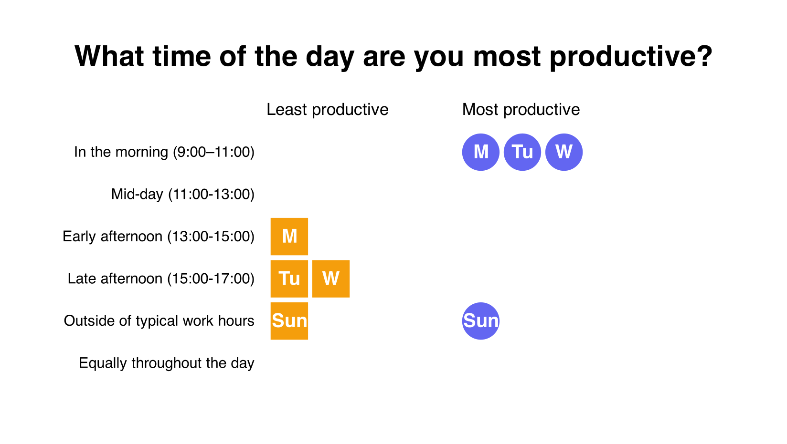

  # The Good Day Project

  ## Week of May 2, 2021 summary

  You logged 5 days this week. Great job!

  ☀️ **2** were Good days (40%).  *These are days you rated as Awesome or Good*

  🌧 **3** were Not-so-good days (60%).  *These are days you rated as OK, Bad, or Terrible*

  On average, your workdays were *😐 OK*.

  Let's take a look at the data you logged for this week.

  ## What did your good and not-so-good days look like?

  First, let's look at how you responded to each question over the week.

  Is there any relationship to how you answered the first *How was your workday* question? We show how you reported the quality of your workday and how you felt about it at the top - see if there are any patterns on the Good days that you can control.

  As a reminder, the quality question options were:

  😭 Terrible

🙁 Bad

😐 OK

🙂 Good

😍 Awesome!

  and the responses to *How did you feel about your workday* question were:

  😬 Tense or nervous

😟 Stressed or upset

😢 Sad or depressed

:yawning_face: Bored

☺️ Calm or relaxed

😌 Serene or content

🙂 Happy or elated

😀 Excited or alert

  

  ## Do you have a typical time of day that feels productive?

  Let's look at which parts of the day you were most and least productive. If there's a clear pattern, could you optimize your schedule to work with your natural productivity?

  

  ---

  If you would like to dig into your data, you can find all of it in the [good-day.csv](./good-day.csv) file.
  